% Git 101
% Michał Zając
% Akademickie Stowarzyszenie Informatyczne

# Agenda

## Git 101

#. Brief history of VCSes
#. A few things before we begin
#. Git basics
#. Branching
#. Customizing Git

# Brief history of VCSes

## SVCS

Simple (or stupid) Version Control System.

<aside class="notes">
  Simple (or stupid) Version Control System - you just copy your files around and pray you don't make a mistake.
</aside>

## LVCS

<aside class="notes">
  A simple database that keeps all the changes under revision control.
</aside>

{.stretch}\ 

## CVCS

{.stretch}\ 

<aside class="notes">
  A single server that contains all the versioned files.
</aside>

## DVCS

{.stretch}\ 

<aside class="notes">
  Everyone is a server.
</aside>

# A few things before we begin

## Introduce yourself

Git would like to know who you are so we have to introduce ourselves.

```
$ git config --global user.name "Michał Zając"
$ git config --global user.email "michal.zajac@gmail.com"
```

## Editor

Git uses you system's default editor unless you tell it to use something else:

```
$ git config --global core.editor vim
```

## Verifying settings

You can check your settings with `git config --list`

```
$ git config --list
user.name=Michał Zając
user.email=michal.zajac@gmail.com
user.signingkey=79313F09
push.default=simple
pull.rebase=preserve
alias.s=status -s
```

## I will be using an alias

`git glog`

Check Facebook event page for details

## Snapshots instead of differences

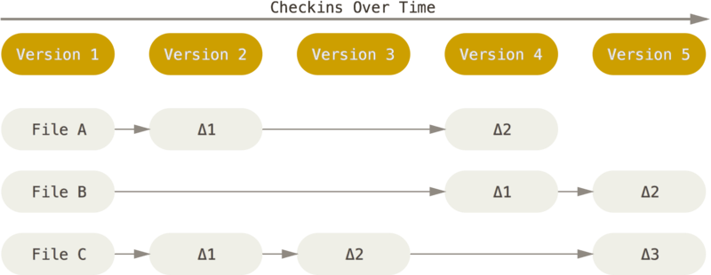{.stretch}\ 

## Snapshots instead of differences

{.stretch}\ 

## Nearly everything is local

Don't have internet connection? Not a problem. <small>*cough* unlike Subversion *cough*</small>

## Git has integrity

## Git generally only adds data

## THIS IS VERY IMPORTANT

##

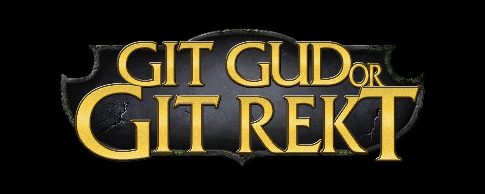{.stretch}\ 

## Three states

Hark for this is main thing to remember from this section if you want your learning to proceed smoothly.

Git has three states that your files can reside in: commited, modified, and staged.

## Three states

{.stretch}\ 

# Git basics

## Creating a Git repository

```
$ cd my_project
$ git init
Initialized empty Git repository in /home/quintasan/my_project
$ git add .
$ git commit -m "Initial commit"
```

## Getting a Git repository

```
$ git clone git@github.com:Quintasan/misc.git
```

## Checking status of your files

`git status` is your friend. Be sure to visit your friends very often.


## Possible file states

{.stretch}\ 

## Tracking new files

`git add` is the way

## Staging modified files

`git add` is also the way

## Ignoring files

Add 'em to `.gitignore`

## Viewing staged and unstaged changes

To view unstaged changes: `git diff`

To view staged changes: `git diff --cached`

## Commiting

This one is obvious - `git commit`

## Removing files

Piece of cake - `git rm`

## Moving files around

`git mv` which is equivalent to

```
$ mv README.md README
$ git rm README.md
$ git add README
```

## Viewing the history

`git log` allows you to browse the commit history

<aside class="notes">
  -p -2 to limit <br>
  --stat for abbereviated stats
  --pretty=oneline to squeeze things
  --log --graph --pretty=format:'%Cred%h%Creset -%C(yellow)%d%Creset %s %Cgreen(%cr) %C(bold blue)<%an>%Creset' --abbrev-commit
</aside>

## Brief intermission

The following sections will touch upon things that can lead to data loss if handled incorrectly.

## One simple rule

Do not rewrite history once you made it public.

## I forgot to add things to a commit

Use `git commit --amend`

<aside class="notes">
  git commit -m "Initial commit" <br>
  git add file_I_forgot <br>
  git commit --amend <br>
</aside>

## Unstaging a staged file

Added too much? Use `git reset HEAD <file>`. For now this is the only reset command you need.

## Unmodifying a modified file

Your refactor was a bad idea afer all? Use `git checkout -- <file>`.

THIS CAN AND WILL RESULT IN DATA LOSS.

## Working with remotes

Since Git is distributed we often have to work with remote hosts.

## Listing remotes

`git remote` will show all remotes

## Adding remotes

`git remote add <name> <url>`

## Fetching and pulling

`git fetch` vs. `git pull`

## Pushing data

`git push <remote name> <branch name>`

## Adding, removing and renaming remotes

`git remote rm <name>`, `git remote rename <name> <new_name>`

# Branching

## Branches in a nutshell

Let us a take a step back and examine how Git stores its data.

<aside class="notes">
  Gdy commitujemy Git tworzy nowy obiekt który zawiera wskaźnik do snapshotu rzeczy które daliśmy do staging area. <br>
  Obiekt ten dodatkowo zawiera imię i nazwisko autora, email oraz commit message oraz wskaźniki na poprzednie commity.
</aside>

## Example

<aside class="notes">
  Mamy repozytorium z trzema plikami, dodajemy wszystkie do staging area i commitujemy. Dodanie czegoś do staging area powoduje obliczenie sumy SHA1 każdego pliku, przechowuje tą wersję pliku (nazywa się to blob) i dodaje taką sumę do staging area.
</aside>

## Example

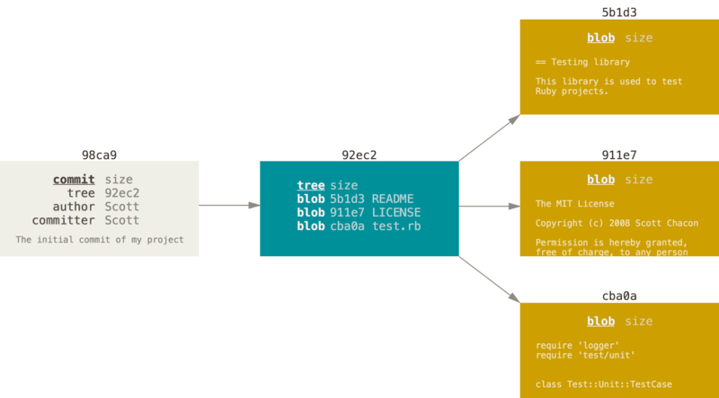{.stretch}\ 

## Example cont.

{.stretch}\ 

## What is a branch?

Essentially branch is a movable pointer to one of these commits.

## A branch and its commit history

{.stretch}\ 

## Creating a new branch

`git branch <branch name>`

## Creating a new branch

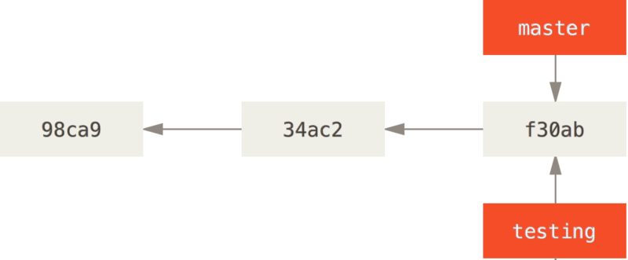{.stretch}\ 

## How does Git know where am I?

It uses it's HEAD (please don't judge me).

## Git using it's HEAD

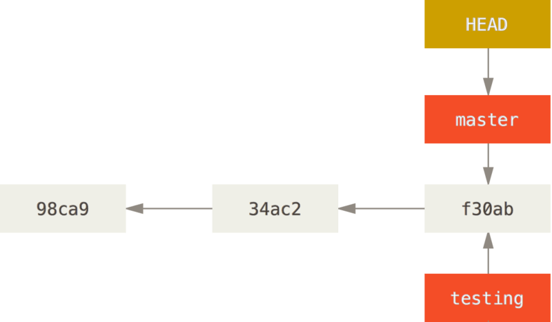{.stretch}\ 

## Switching branches

`git checkout <branch name>`

## Switching branches

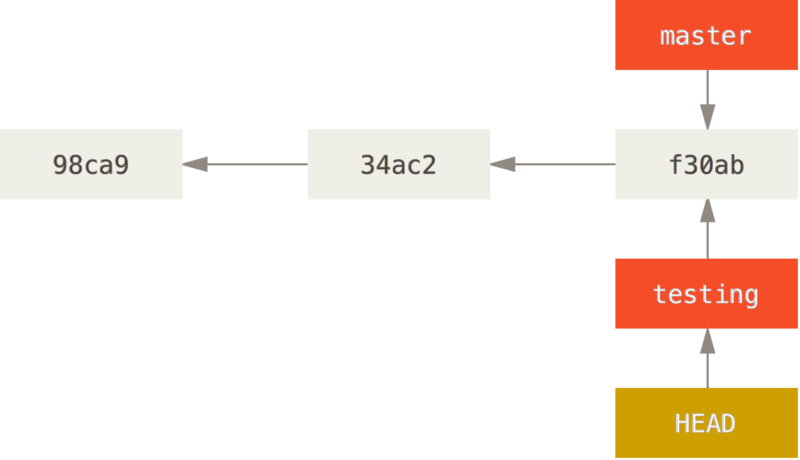{.stretch}\ 

## Advancing branches

Let's change something and see the state of our branches.

## Advancing branches

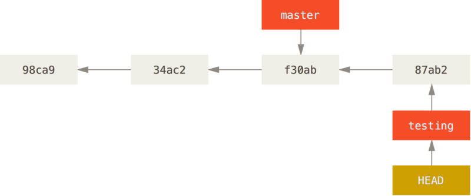{.stretch}\ 

## Diverging master

Let's go back to master and change something as well.

## Diverging master

{.stretch}\ 

## Basic branching and merging

## Scenario

We're working on a website and we're writing a new story. Suddenly we receive a call about a critical issue that we have to fix.

## Steps

#. Create a new branch for a story
#. Start working in that branch
#. Switch to the production branch
#. Create a branch for the hotfix
#. Merge the hotfix branch and push to production
#. Switch back to our story branch and continue working
#. Merging our story

## A worked example

## New branch

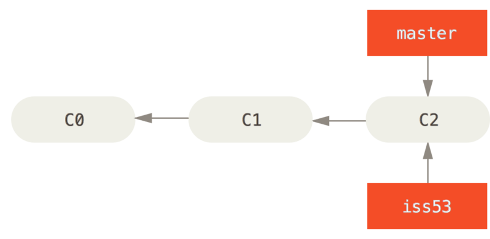{.stretch}\ 

## Commiting a post

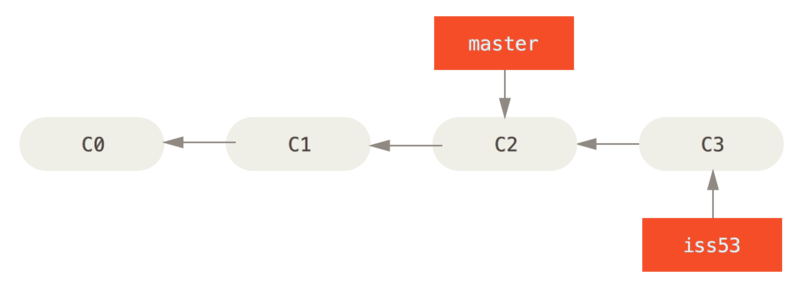{.stretch}\ 

## Creating the hotfix branch

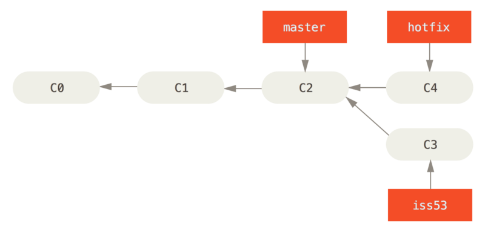{.stretch}\ 

## Merging hotfix branch

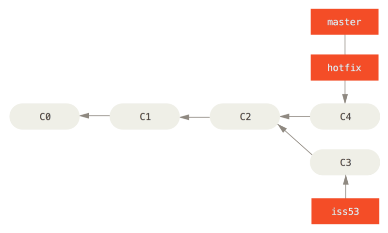{.stretch}\ 

## Finishing our post

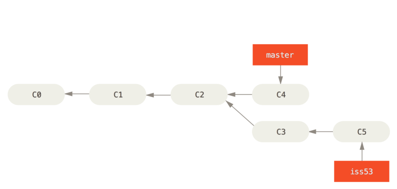{.stretch}\ 

## Merging our changes

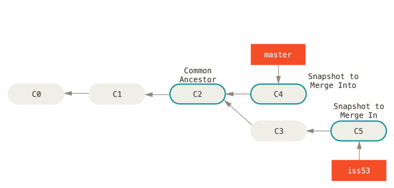{.stretch}\ 

## Merging our changes

{.stretch}\ 

## Conflicts

Conflits happen more often than don't. First rule: don't panic.

## Example

# Customizing git

## Aliases

## Nice history

```
git config --global alias.glog log --graph --pretty=format:'%Cred%h%Creset -%C(yellow)%d%Creset %s %Cgreen(%cr) %C(bold blue)<%an>%Creset' --abbrev-commit
```

## Short status

git config --global alias.s status -s

## List of files that changed in a commit

```
git config --global alias.lshow diff-tree --no-commit-id --name-status -r
```

## List of commits that modify a file

`git config --global filelog log -u`

# Finishing up

## Questions?

## Further reading

#. [Git documentation](https://git-scm.com/docs)
#. [Pro Git](https://git-scm.com/book/en/v2)
#. [Pro Git - Git Tools](https://git-scm.com/book/en/v2/Git-Tools-Revision-Selection)
#. [Pro Git - Git in Other Environments](https://git-scm.com/book/en/v2/Git-in-Other-Environments-Graphical-Interfaces)
#. [Git videos](https://git-scm.com/videos)
#. [External links](https://git-scm.com/doc/ext)

# Thanks for your attention
